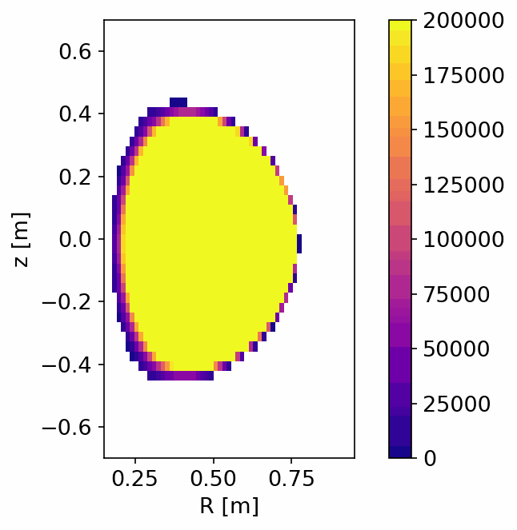

# STEPControl Project Use Cases

Use cases for the UKAEA/digiLab STEPControl 2024 project, which developed modern Bayesian Experimental Design techniques for tokamak control system design. Specifically the framework focuses on optimizing, analysing, and comparing sensor configurations relevent to the STEP programme. 

The project developed two use cases to demonstrate the value of the design framework. The first focuses on redundancy analysis for poloidal magnetic sensors, and the second integrated optimisation of multiple imaging systems.

# How to use the framework

# Magnetics Use Case

# Imaging Use Case

